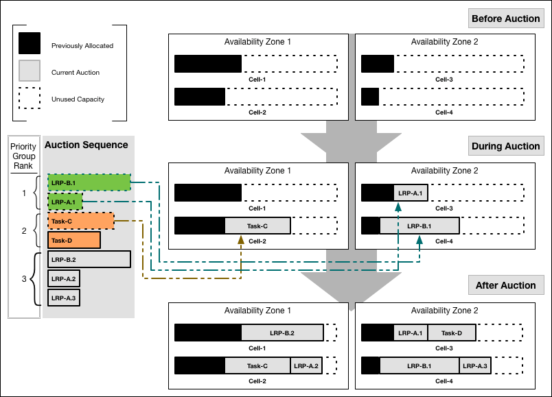

# 

```
Allocate all jobs only to Cells that have the correct software stack to host them, and sufficient resources given their allocation so far during this auction.

Allocate LRP instances into Availability Zones that are not already hosting other instances of the same LRP.

Within each Availability Zone, allocate LRP instances to run on Cells that are not already hosting other instances of the same LRP.

Allocate any job to the Cell that has lightest load, from both the current auction and jobs it has been running already. In other words, distribute the total load evenly across all Cells.

Diego Brain
Diego Brain distribute Tasks and LRPs to Diego Cells and corrects discrepancies between Actual and Desired counts to ensure fault-tolerance and long-term consistency. The Diego Brain consists of the Auctioneer.

Auctioneer 
Holds auctions for Tasks and LRP instances
Distributes work using the auction algorithm. Auction communication is sent between the Auctioneer and the Cell Reps over HTTPS. For more information about the auction algorithm, see How the Diego Auction Allocates Jobs.
Maintains a lock in Locket to ensure only one auctioneer handles auctions at a time
```

## Reference

- [Cloud Foundry Diego Auction Algorithms](https://docs.cloudfoundry.org/concepts/diego/diego-auction.html)