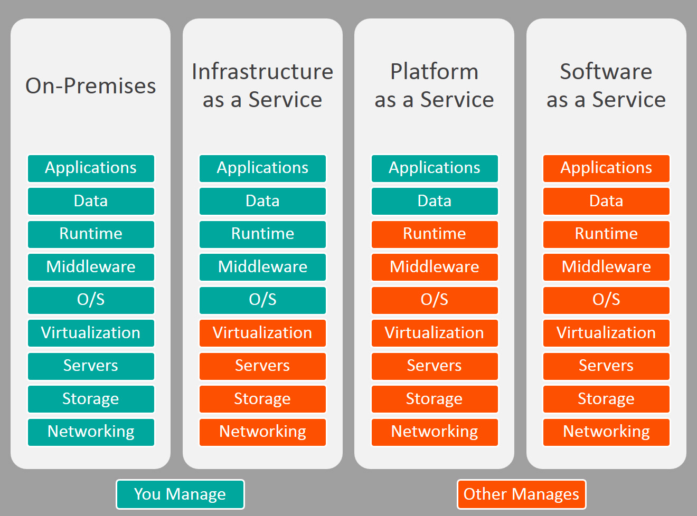
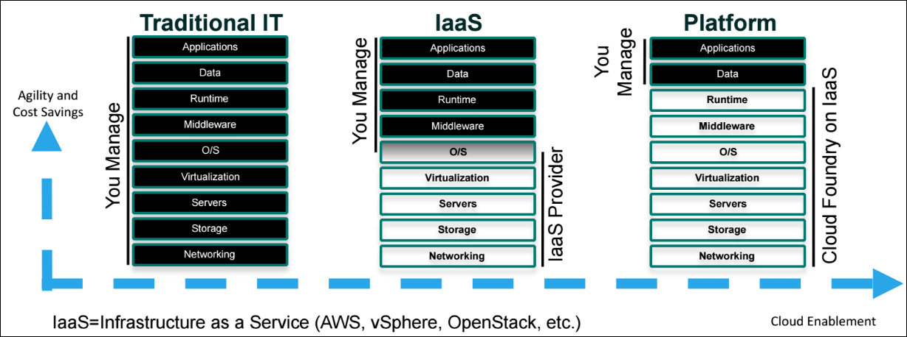

# Cloud Architecture

#3 Cloud Services Providers

* [Amazon AWS]
* [Microsoft Azure]
* [Google Cloud Platform]
* [OpenStack]
* [VMWare vSphere]
* [SoftLayer]
* [Cloud Foundry](cloud-foundry/cloud-foundry.md)

#3 Cloud Benefits

* [Cloud Computing: The 15 Ways Your Business Can Benefit from the Cloud](https://www.thorntech.com/2016/06/cloud-computing-the-15-ways-your-business-can-benefit-from-the-cloud/)

#3 [IaaS vs PaaS vs SaaS](https://www.bmc.com/blogs/saas-vs-paas-vs-iaas-whats-the-difference-and-how-to-choose)

#3 

* [VMware Integrate OpenStack](https://www.vmware.com/products/openstack.html)
* [VMware ESXi](https://en.wikipedia.org/wiki/VMware_ESXi)
* [VMware NSX](https://www.vmware.com/products/nsx.html)
* [VMware vSan](https://www.vmware.com/products/vsan.html)

#3 PaaS

* [Heroku](https://www.heroku.com)
* [Microsoft System Center](https://partner.microsoft.com/en-us/solutions/microsoft-system-center)
  
# private cloud

* [eucalptus](../../tool/eucalptus/eucalptus.md)
  
# private/public cloud

* [openstack](../../tool/openstack/openstack.md) 

# hybird cloud

* [重新定义服务与交付方法](https://www.ibm.com/developerworks/cn/cloud/library/cl-hybridcloud1/)
* [Using Terraform Across Multiple Cloud Providers](http://darylscorner.com/2016/11/using-terraform-across-multiple-cloud-providers/)

# [multi-cloud](multi-cloud/multi-cloud.md)

# Reference

* [CNCF Cloud Native](https://landscape.cncf.io/)
* [CNCF Cloud Native Git Repository](https://github.com/cncf/landscape)
* [IDC FutureScape: Worldwide Cloud 2017 Predictions](https://www.idc.com/research/viewtoc.jsp?containerId=US41863916)