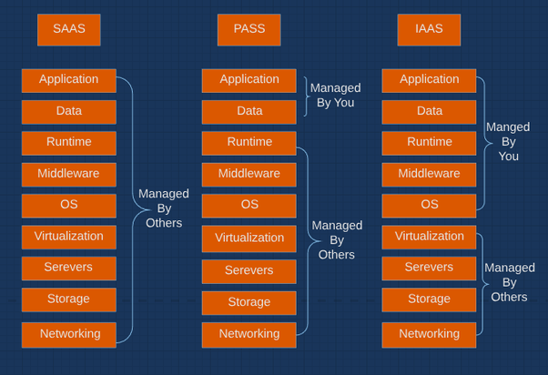

# [IaaS vs PaaS vs SaaS](https://www.bmc.com/blogs/saas-vs-paas-vs-iaas-whats-the-difference-and-how-to-choose)

# IaaS

* [VMware Integrate OpenStack](https://www.vmware.com/products/openstack.html)
* [VMware ESXi](https://en.wikipedia.org/wiki/VMware_ESXi)
* [VMware NSX](https://www.vmware.com/products/nsx.html)
* [VMware vSan](https://www.vmware.com/products/vsan.html)

# PaaS

* [Heroku](https://www.heroku.com)

* []
  
# private cloud

* [eucalptus](../../tool/eucalptus/eucalptus.md)
  
# private/public cloud

* [openstack](../../tool/openstack/openstack.md) 

# hybird cloud

* [重新定义服务与交付方法](https://www.ibm.com/developerworks/cn/cloud/library/cl-hybridcloud1/)
* [Using Terraform Across Multiple Cloud Providers](http://darylscorner.com/2016/11/using-terraform-across-multiple-cloud-providers/)

# Reference

* [CNCF Cloud Native](https://landscape.cncf.io/)
* [CNCF Cloud Native Git Repository](https://github.com/cncf/landscape)