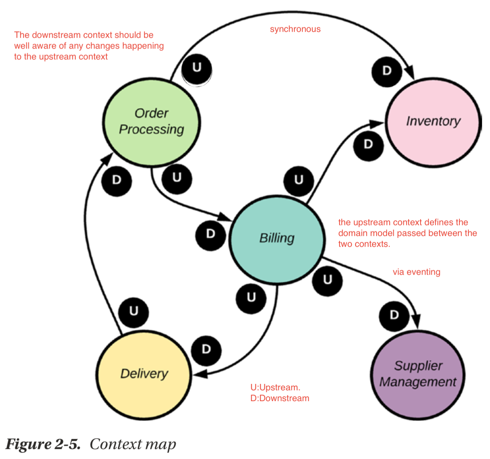

# Architecture Diagram Overview

* 
* bounded context helps encapsulating business logic within a service boundary and helps define the service interface.
* In order to propagate to other parties properly
* 