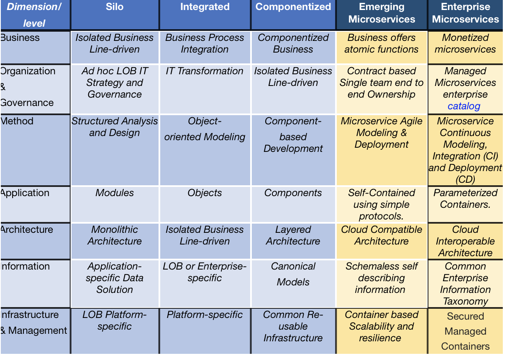

# Microservices Maturity Model #ibmaot

fiammante  | May 6 2017 ‎  | 7,999 Views 0 people like this
 
Opengroup has standardized  the [Open Group Service Integration Maturity Model (OSIMM)](http://www.opengroup.org/soa/source-book/osimmv2/)  which provides means to assess and organization SOA maturity levels and to define desired target maturity for an SOA roadmap.
On the Opengroup site there also is a [Microservices architecture](http://www.opengroup.org/soa/source-book/msawp/index.htm) where it is stated that a Microservices Architecture is a subset of SOA. However the SOA maturity model had not been adapted for microservices.
Here are my first toughts on a Microservices Maturity Model, that incorporates recent industry practices.
First I reduce the levels to 5, as in my OSIMM practice I never had maturities above level 5. Then I replace the level 4 and 5 by a microservices version, where the level 5 is able to bill microservices or have an explicit funding, is using cloud environment and is based on agile approaches.
On the business dimension, the end goal is to make direct or indirect profit from microservices.
The governance dimension is also lightened for each services, however the level 5 maturity requires an enterprise catalog that is managed with a common approach, including billing and documentation.
The method is adapted to the microservices short cycles with agile method and continuous delivery and improvement with the latests DevOps approaches.
The applications use flexible protocols such as REST. The packaging evolves towards containers technologies like Docker, which are contructed to be parameterized and can be integrated with other services containers.
On the information side flexibility and a common taxonomy becomes the goal. Schema less approach with JSON provide variability and limit the propagation of changes and the need for versioning.
Of course the architecture targets a cloud reference architecture such as the one from NIST  or its extension in the ISO cloud interoperability and portability future standard.
Finally for the infrastructure services are ultimately hosted on PaaS enabled platforms like Cloudfoundry.

## Reference

* [Microservices Maturity Model #ibmaot](https://www.ibm.com/developerworks/community/blogs/Marc/entry/Microservices_Maturity_Model?lang=en)