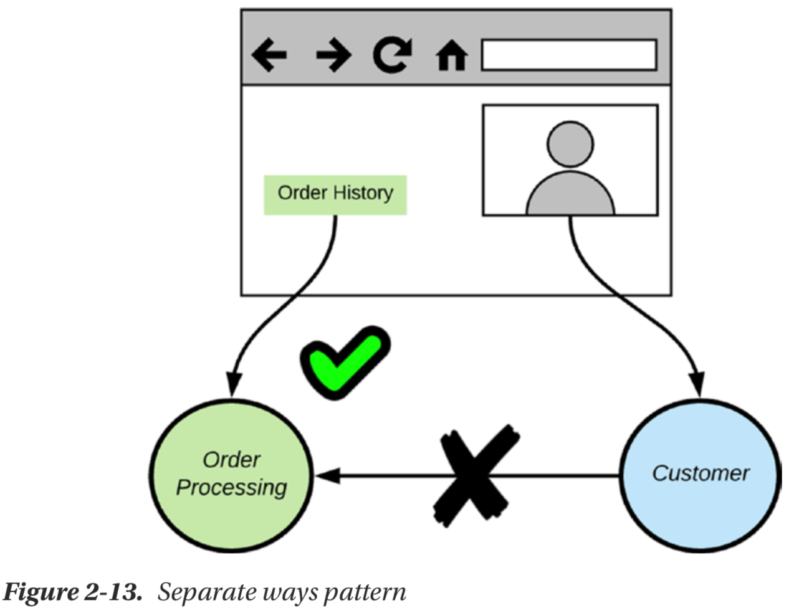

# architecture patterns

* request/response pattern
* request/acknowledge pattern
* pushlish/subscribe pattern
* one-way pattern
* stream pattern

* Anit-corrupton layer pattern

where the order entity has two different definitions under the Order Processing and Inventory bounded contexts. For the communication between these two bounded contexts, the contract is defined
by the Inventory bounded context (see Figure 2-5). When Order Processing updates the Inventory, it has to translate its own order entity to the order entity, which is understood by the Inventory bounded context. We use the anti-corruption layer (ACL) pattern to address this concern.

* Sidecar pattern

  the sidecar pattern is derived from the vehicle where a sidecar is attached to a motorcycle. If you’d like, you can attach different sidecars (of different colors or designs) to the same motorcycle, provided that the interface between those
two is unchanged. The same applies in the microservices world, where our microservice resembles the motorcycle, while the translation layer resembles the sidecar. If any
change happens to the monolithic application, we only need to change the sidecar implementation to be compliant with it—and no changes to the microservice.
  The communication between the microservice and the sidecar happens over
the network (not a local, in-process call), but both the microservice and sidecar are co-located in the same host—so it will not be routed over the network.

* Shared kernel pattern

Different domains could be using their own authorization policies, but in many cases they share the same domain model as
the authorization service (the authorization service itself is a microservice or a separate bounded context). In such cases, the domain model of the authorization service acts as the shared kernel. Since there is a shared code dependency (probably wrapped into a library), to make the shared kernel pattern work in practice, all the teams who use the shared kernel have to collaborate well with each other.

* customer/supplier

A customer does not have complete say over what a supplier does. But, then again, the supplier cannot totally ignore customer feedback. A good supplier will always listen to its customers, extract the positives, give feedback back to the customers, and produce the best products to address their needs. No point in producing something useless to its customers. This is the level of collaboration expected between upstream/downstream contexts adhering to the customer/supplier pattern. This helps the downstream contexts to provide suggestions, and request changes to the interface between the two contexts. Following this pattern, there is more responsibility on the upstream context. A given upstream context not only deals with one downstream context. You need to be extra careful that a suggestion from one downstream context does not break the contract between the upstream context and another downstream context

* Conformist pattern

he upstream context defines the domain model passed between the two contexts. The downstream context should be well aware of any changes happening to the upstream context. The conformist pattern states that the downstream context (the conformist) has to conform to the contract defined by the upstream context.
The conformist pattern looks similar to the shared kernel, where both patterns have a shared domain model. The difference is in the decision-making and the development process. The shared kernel is a result of the collaboration between two teams that coordinate tightly, while the conformist pattern deals with integration with a team that is not interested in collaboration—possibly a third-party service, where you have no control. For example, you may use the PayPal API to process payments. PayPal is never going to change its API to fit you, rather your bounded context has to comply with it. In case this integration makes your domain model look ugly, you can possibly introduce an anti-corruption layer to isolate the integration in just one place.

* Partnership pattern

When we have two or more teams building microservices under different bounded contexts, but overall moving toward the same goal, and there are notable inter-dependencies between them, partnership pattern is an ideal way to build collaboration. Teams can collaborate
in making decisions over the technical interfaces, release schedules, and anything of common interest. The partnership pattern is also applicable to any teams using the shared kernel pattern. The collaboration required to build the shared kernel can be established via a partnership. Also keep in mind that the output of the partnership pattern is not necessarily a shared kernel. It can be any interdependent services with nothing concrete to share

* Published language

There we have a Java to JSON parser at the Order Processing microservice end, which knows how to create a JSON document from a Java object model. We use the JSON to C# parser at the Inventory microservice end to build a C# object model from a JSON document.

* Open host servce pattern

In the anti-corruption layer pattern we have a translation layer between upstream and downstream microservices (or bounded contexts).
When we have multiple downstream services, each downstream service has to handle the translation.If each of these downstream microservice has its own domain model, it doesn’t matter. We cannot avoid the translation happening at each end. But, if we have many downstream microservices doing the same translation, then it’s a duplication of the effort. The open host service pattern suggests an approach to overcome this.
One way to implement the open host service pattern is to expose the upstream microservice functionality via an API, and the API does the translation. Now, all the downstream microservices, which share the same domain model, can talk to the API (instead of the upstream microservice) and follow either the conformist or customer/ supplier pattern.

* Separate Ways

Let’s revisit the microservices design we did for our e-commerce application. There we have a Customer microservice and an Order Processing microservice (see Figure 2-2). Think of a customer portal, which talks to the Customer microservice and displays user profile. It may be useful to the end user to see his/her order history, along with the profile data. But the Customer microservice does not have direct access to the order history of a given customer; it’s under the control of Order Processing microservice. One way to facilitate this is to integrate the Order Processing microservice with the Customer microservice, and change the domain model of the Customer microservice to return the order history along with the profile data, which is a costly integration.
Integration is always expensive and sometimes the benefit is small. The separate ways pattern suggests avoiding such costly integrations, and finds other ways to cater such requests. For example, in this particular scenario, we can avoid the integration between the Order Processing microservice and the Customer microservice and provide a link to the customer portal, along with the profile data to retrieve order history, and that will directly talk to the Order Processing microservice

* Big ball of mud pattern

Most of the time you don’t get a chance to work on a green-field project. Always you find some kind of a legacy system with lots of resistance to integrate with other systems in a standard manner. These systems do not have clear boundaries and clean domain models. The big ball of mud pattern highlights the need to identify such systems and treat them in a special context. We should not try to apply sophisticated modeling to these contexts, but rather find a way to integrate via an API or some kind of a service interface and use an anti-corruption layer pattern at the downstream service end.

* Bulkheads pattern

Bulkheads are mostly used in ships and boats to build watertight compartments, so that if one compartment is caught in the water, the people can move to another compartment for safety. The damage in one compartment will not take the ship completely down, as the compartments are isolated from each other.
The bulkheads pattern borrows this same concept . This pattern highlights how we can allocate resources, such as thread pools, which are connection pools for outbound connections. If we have one single thread pool for all outbound endpoints, then, if one endpoint happens to be slow in responding, releasing the corresponding thread to the pool will take more time. If this repeats consistently then will have an impact on requests directed to other endpoints as well, since more threads are now waiting on the slow endpoint. Following the bulkheads pattern, we can have one thread pool per endpoint— or in a way you can logically group those together. This prevents an issue in one bad endpoint being propagated into other good endpoints. The bulkheads pattern partitions capacity to preserve partial functionality when bad things happen.

* Steady State pattern

  The steady state pattern highlights the need of adhering to a design that lets your
system run in a steady state for a long time without frequent interventions.
  keep humans away from it whenever possible
  The design of the system should have a way to clean such data periodically via an automated process
 
* Fast Failed pattern

  Fail fast pattern highlights the need for making decisions early in the flow of execution, if the request is going to fail or be rejected. For example, if the load balancer already knows that a given node is down, there is no point in sending requests there again and again to find out its up or not. Rather, that node can be marked as a faulty node until you hear a valid heartbeat from it. The circuit breaker pattern can also be used to implement a fail fast strategy. With the circuit breaker pattern, we can isolate faulty endpoints, and any requests going out for such endpoints can be rejected without retrying, until circuit breaker decides that it’s time to recheck.

* Let It Crash pattern

  There are many cases where doctors decide to cut off the leg of a person after a serious accident to save that person’s life. This helps to prevent propagating serious damage from the leg to the other parts of the body. In the Erlang5 world, this is called the “let it crash” philosophy. It may be useful at sometimes to abandon a subsystem to preserve the stability of the overall system. The let it crash approach suggests getting back to a clean startup as rapidly as possible, in case the recovery is difficult and unreliable
due to a failure. This is a very common strategy in microservice deployments. A given microservice addresses a limited scope of the overall system, and taking it down and booting up again will have a minimal impact on the system. This is being well supported by the one microservice per host strategy with containers. Having a rapid server startup time, probably a few milliseconds, is also a key aspect in making this strategy successful.

* Handshaking pattern

  Handshaking is mostly used to share requirements between two parties to establish a communication channel. This happens prior to establishing a TCP (transmission control protocol) connection, which is commonly known as the TCP three-way handshake. Also, we see a handshake before establishing a TLS (transport layer security) connection. These are the two most popular handshaking protocols in computer science. The handshaking pattern suggests the use of a handshake by the server to protect it by throttling its own workload. When a microservice is behind a load balancer, it can use this handshaking technique to inform the load balancer whether it is ready to accept more requests or not. Each server hosting the microservice can provide a lightweight health check endpoint. The load balancer can periodically ping this endpoint and see whether the corresponding microservice is ready to accept requests.

* Test Harness pattern

  All the failures in a distributed system are hard to catch, either in development testing or in QA (quality assurance) testing. Integration testing possibly looks like a better option, but it has its own limitations. Most of the time we build integration tests as per a specification provided by the corresponding service endpoint. Mostly it covers success scenarios, and even in failure cases it defines what exactly to expect, for example the error codes. Not all the systems all the time work as per the specifications. The test harness pattern suggests an approach for integration testing that would allow us to test most of the failure modes, even outside the service specifications.
The test harness is another remote endpoint that represents each of the remote endpoints you need to connect from your microservice. The difference between the test harness and the service endpoint is that the test harness is just for testing failures and
it does not worry about the application logic. Test harness has to be written so that it is capable of generating all sorts of errors covering all seven layers of the OSI (open systems interconnection) model. For example, the test harness may send connection refused responses, invalid TCP packets, slow responses, responses with incorrect content types (XML instead of JSON), and many other errors, that we would never expect from the service endpoint under normal circumstances.

* Shed load pattern

  If we look at the way TCP (transmission control protocol) works, it provides a listen queue per port. When the connections are flooded against a given port, then all of them will be queued. Each pool has a maximum limit and when the limit is reached, no more connections will be accepted. When the queue is full, any new attempt to establish a connection will be rejected with an ICMP RST (reset) packet. This is how TCP sheds load at the TCP layer. The applications running on top of the TCP layer will pull requests from the TCP connection pool. In practice, most of the applications are exhausted with connections before the TCP connection pool reaches its maximum. The shed load pattern suggests that the applications or the services also should be modeled after TCP.
The application should shed load when it finds out that it is running behind a given SLA (service level agreement). Usually when the applications are exhausted and the running threads are blocked on certain resources, the response time starts to degrade. Such indicators help show whether a given service is running behind an SLA. If so, this pattern advocates shedding load or notifying the load balancer that the service is not ready to accept more requests. This can be combined with the handshaking pattern to build a better solution.

* Observability pattern

    We may need to track throughput of each microservice, the number of success/failed requests, utilization of CPU, memory and other network resources, and some business related metrics.
    Observability is a measure of how well internal states of a system can be inferred from knowledge of their external outputs.
    Collecting data is cheap, but not having it when you need it can be expensive.
    if they had the right level of data collected, they could have predicted such behavior or recovered from it as soon as it happened by identifying the root cause. The more information we have, the better decisions we can make.

* Automation pattern
   One of the key rationales behind a microservice architecture is less time to production and shorter feedback cycles. We cannot meet such goals with no automation. A good microservices architecture will only look good on paper (or a whiteboard), if not for the timely advancements in DevOps and tooling around automation.
   Tooling around automation can be divided into two broad categories—continuous integration tools and continuous deployment tools. Continuous integration enables software development teams to work collaboratively, without stepping on each other's toes. They can automate builds and source code integration to maintain source code integrity. They also integrate with DevOps tools to create an automated code delivery pipeline. Forrester, one of the top analyst firms, in its latest report7 on continuous integration tools, identifies the top ten tools in the domain: Atlassian Bamboo, AWS CodeBuild, CircleCI, CloudBees Jenkins, Codeship, GitLab CI, IBM UrbanCode Build, JetBrains TeamCity, Microsoft VSTS, and Travis CI.
The continuous delivery tools bundle applications, infrastructure, middleware, and the supporting installation processes and dependencies into release packages that transition across the lifecycle. The latest Forrester report8 on continuous delivery and release automation highlights 15 most significant vendors in the domain: Atlassian,
CA Technologies, Chef Software, Clarive, CloudBees, Electric Cloud, Flexagon, Hewlett Packard Enterprise (HPE), IBM, Micro Focus, Microsoft, Puppet, Red Hat, VMware, and XebiaLabs.

## reference

* streaming data-understanding the real-time pipeline-Manning.2017
* Microservices for the Enterprise_Designing Developing, and Deploying