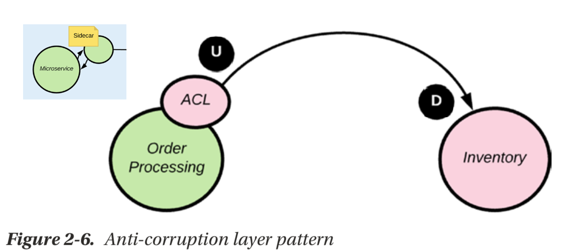
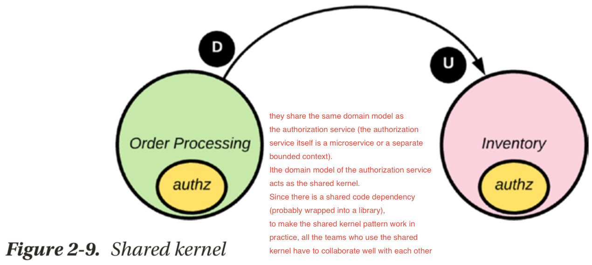
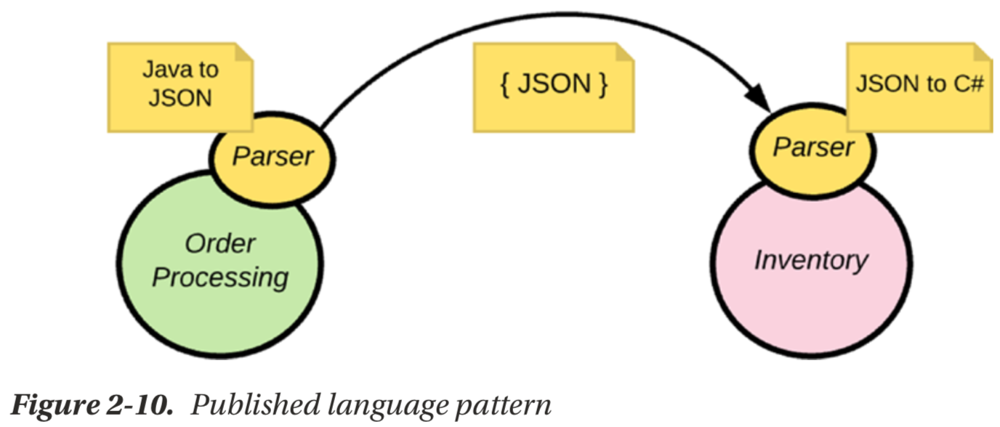
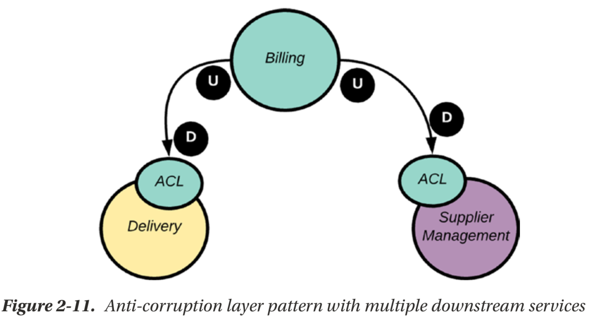
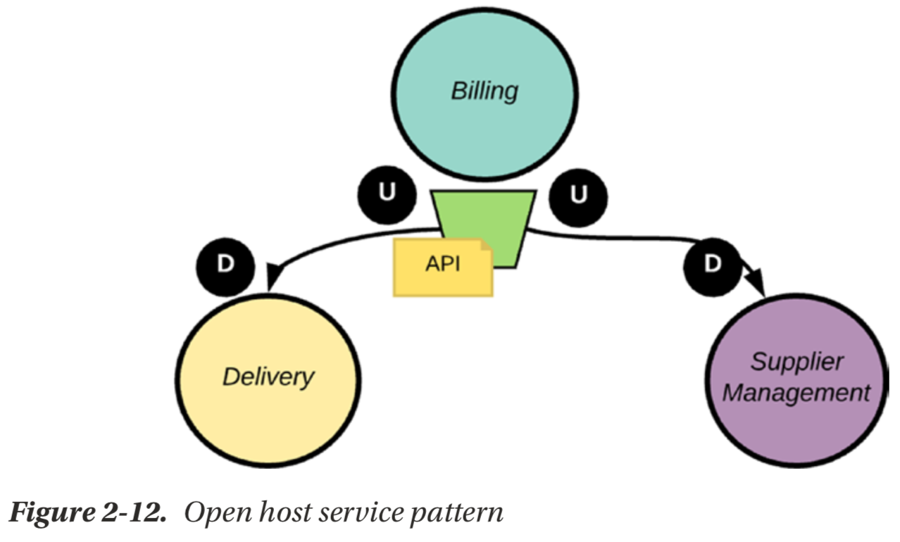

# architecture patterns

* request/response pattern
* request/acknowledge pattern
* pushlish/subscribe pattern
* one-way pattern
* stream pattern

* Anit-corrupton layer pattern

where the order entity has two different definitions under the Order Processing and Inventory bounded contexts. For the communication between these two bounded contexts, the contract is defined
by the Inventory bounded context (see Figure 2-5). When Order Processing updates the Inventory, it has to translate its own order entity to the order entity, which is understood by the Inventory bounded context. We use the anti-corruption layer (ACL) pattern to address this concern.

* Sidecar pattern

  the sidecar pattern is derived from the vehicle where a sidecar is attached to a motorcycle. If you’d like, you can attach different sidecars (of different colors or designs) to the same motorcycle, provided that the interface between those
two is unchanged. The same applies in the microservices world, where our microservice resembles the motorcycle, while the translation layer resembles the sidecar. If any
change happens to the monolithic application, we only need to change the sidecar implementation to be compliant with it—and no changes to the microservice.
  The communication between the microservice and the sidecar happens over
the network (not a local, in-process call), but both the microservice and sidecar are co-located in the same host—so it will not be routed over the network.

* Shared kernel pattern

Different domains could be using their own authorization policies, but in many cases they share the same domain model as
the authorization service (the authorization service itself is a microservice or a separate bounded context). In such cases, the domain model of the authorization service acts as the shared kernel. Since there is a shared code dependency (probably wrapped into a library), to make the shared kernel pattern work in practice, all the teams who use the shared kernel have to collaborate well with each other.

* customer/supplier

A customer does not have complete say over what a supplier does. But, then again, the supplier cannot totally ignore customer feedback. A good supplier will always listen to its customers, extract the positives, give feedback back to the customers, and produce the best products to address their needs. No point in producing something useless to its customers. This is the level of collaboration expected between upstream/downstream contexts adhering to the customer/supplier pattern. This helps the downstream contexts to provide suggestions, and request changes to the interface between the two contexts. Following this pattern, there is more responsibility on the upstream context. A given upstream context not only deals with one downstream context. You need to be extra careful that a suggestion from one downstream context does not break the contract between the upstream context and another downstream context

* Conformist pattern

he upstream context defines the domain model passed between the two contexts. The downstream context should be well aware of any changes happening to the upstream context. The conformist pattern states that the downstream context (the conformist) has to conform to the contract defined by the upstream context.
The conformist pattern looks similar to the shared kernel, where both patterns have a shared domain model. The difference is in the decision-making and the development process. The shared kernel is a result of the collaboration between two teams that coordinate tightly, while the conformist pattern deals with integration with a team that is not interested in collaboration—possibly a third-party service, where you have no control. For example, you may use the PayPal API to process payments. PayPal is never going to change its API to fit you, rather your bounded context has to comply with it. In case this integration makes your domain model look ugly, you can possibly introduce an anti-corruption layer to isolate the integration in just one place.

* Partnership pattern

When we have two or more teams building microservices under different bounded contexts, but overall moving toward the same goal, and there are notable inter-dependencies between them, partnership pattern is an ideal way to build collaboration. Teams can collaborate
in making decisions over the technical interfaces, release schedules, and anything of common interest. The partnership pattern is also applicable to any teams using the shared kernel pattern. The collaboration required to build the shared kernel can be established via a partnership. Also keep in mind that the output of the partnership pattern is not necessarily a shared kernel. It can be any interdependent services with nothing concrete to share

* Published language

There we have a Java to JSON parser at the Order Processing microservice end, which knows how to create a JSON document from a Java object model. We use the JSON to C# parser at the Inventory microservice end to build a C# object model from a JSON document.

* Open host servce pattern

In the anti-corruption layer pattern we have a translation layer between upstream and downstream microservices (or bounded contexts).
When we have multiple downstream services, each downstream service has to handle the translation.If each of these downstream microservice has its own domain model, it doesn’t matter. We cannot avoid the translation happening at each end. But, if we have many downstream microservices doing the same translation, then it’s a duplication of the effort. The open host service pattern suggests an approach to overcome this.
One way to implement the open host service pattern is to expose the upstream microservice functionality via an API, and the API does the translation. Now, all the downstream microservices, which share the same domain model, can talk to the API (instead of the upstream microservice) and follow either the conformist or customer/ supplier pattern.

## reference

* streaming data-understanding the real-time pipeline-Manning.2017
* Microservices for the Enterprise_Designing Developing, and Deploying