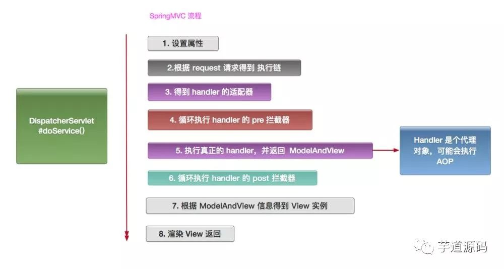

# Alibaba Medium Java Developer

## Algorithms and Data Structure

* B+树
* 快速排序，堆排序，插入排序（其实八大排序算法都应该了解)
* 一致性Hash算法，一致性Hash算法的应用

## linux系统

* more , less ,most

## Java基础

* List 和 Set 的区别
* HashSet 是如何保证不重复的
* HashMap 是线程安全的吗，为什么不是线程安全的（最好画图说明多线程环境下不安全）?
* HashMap 的扩容过程
* HashMap 1.7 与 1.8 的 区别，说明 1.8 做了哪些优化，如何优化的？
* final finally finalize
* 强引用 、软引用、 弱引用、虚引用
* Java反射
* Arrays.sort 实现原理和 Collection 实现原理
* LinkedHashMap的应用
* cloneable接口实现原理
* 异常分类以及处理机制
* wait和sleep的区别
* 数组在内存中如何分配
* HashMap的源码，实现原理，JDK8中对HashMap做了怎样的优化。
* HaspMap扩容是怎样扩容的，为什么都是2的N次幂的大小。
* HashMap，HashTable，ConcurrentHashMap的区别。
* 极高并发下HashTable和ConcurrentHashMap哪个性能更好，为什么，如何实现的。
* HashMap在高并发下如果没有处理线程安全会有怎样的安全隐患，具体表现是什么。
* java中四种修饰符的限制范围。
* Object类中的方法。
* 接口和抽象类的区别，注意JDK8的接口可以有实现。
* 动态代理的两种方式，以及区别。
* Java序列化的方式。
* 传值和传引用的区别，Java是怎么样的，有没有传值引用。
* 一个ArrayList在循环过程中删除，会不会出问题，为什么。
* @transactional注解在什么情况下会失效，为什么
* junit用法，before,beforeClass,after, afterClass的执行顺序
* 分布式锁
* nginx的请求转发算法，如何配置根据权重转发
* 用hashmap实现redis有什么问题（死锁，死循环，可用ConcurrentHashmap）
* 线程的状态
* 线程的阻塞的方式
* sleep和wait的区别
* hashmap的底层实现
* 一万个人抢*个红包，如何实现（不用队列），如何保证2个人不能抢到同一个红包，可用分布式锁
* java内存模型，垃圾回收机制，不可达算法
* 两个Integer的引用对象传给一个swap方法在方法内部交换引用，返回后，两个引用的值是否会发现变
* aop的底层实现，动态代理是如何动态，假如有*个对象，如何动态的为这*个对象代理
* 是否用过maven install。 maven test。git（make install是安装本地jar包）
* tomcat的各种配置，如何配置docBase
* spring的bean配置的几种方式
* web.xml的配置
* spring的监听器。
* zookeeper的实现机制，有缓存，如何存储注册服务的
* IO会阻塞吗？readLine是不是阻塞的
* 用过spring的线程池还是java的线程池？
* 字符串的格式化方法 （**两个问题问的太低级了）
* 时间的格式化方法
* 定时器用什么做的
* 线程如何退出结束
* java有哪些锁？乐观锁 悲观锁 synchronized 可重入锁 读写锁,用过reentrantlock吗？reentrantlock与synmchronized的区别
* ThreadLocal的使用场景
* java的内存模型，垃圾回收机制
* 为什么线程执行要调用start而不是直接run（直接run，跟普通方法没什么区别，先调start，run才会作为一个线程方法运行）
* qmq消息的实现机制(qmq是去哪儿网自己封装的消息队列)
* 遍历hashmap的三种方式
* jvm的一些命令
* memcache和redis的区别
* mysql的行级锁加在哪个位置
* ConcurrentHashmap的锁是如何加的？是不是分段越多越好
* myisam和innodb的区别（innodb是行级锁，myisam是表级锁）
* mysql其他的性能优化方式
* linux系统日志在哪里看
* 如何查看网络进程
* 统计一个整数的二进制表示中bit为1的个数
* jvm内存模型，java内存模型

## Java 并发

* synchronized 的实现原理以及锁优化？
* volatile 的实现原理？
* Java 的信号灯？
* synchronized 在静态方法和普通方法的区别？
* 怎么实现所有线程在等待某个事件的发生才会去执行？
* CAS？CAS 有什么缺陷，如何解决？
* synchronized 和 lock 有什么区别？
* Hashtable 是怎么加锁的 ？
* HashMap 的并发问题？
* ConcurrenHashMap 介绍？1.8 中为什么要用红黑树？
* AQS
* 如何检测死锁？怎么预防死锁？
* Java 内存模型？
* 如何保证多线程下 i++ 结果正确？
* 线程池的种类，区别和使用场景？
* 分析线程池的实现原理和线程的调度过程？
* 线程池如何调优，最大数目如何确认？
* ThreadLocal原理，用的时候需要注意什么？
* CountDownLatch 和 CyclicBarrier 的用法，以及相互之间的差别?
* LockSupport工具
* Condition接口及其实现原理
* Fork/Join框架的理解
* 分段锁的原理,锁力度减小的思考
* 八种阻塞队列以及各个阻塞队列的特性
* Java实现多线程有哪几种方式
* Callable和Future的了解。
* 线程池的参数有哪些，在线程池创建一个线程的过程。
* volitile关键字的作用，原理。
* synchronized关键字的用法，优缺点。
* Lock接口有哪些实现类，使用场景是什么。
* 可重入锁的用处及实现原理，写时复制的过程，读写锁，分段锁（ConcurrentHashMap中的segment）。
* 悲观锁，乐观锁，优缺点，CAS有什么缺陷，该如何解决。
* ABC三个线程如何保证顺序执行。
* 线程的状态都有哪些。
* sleep和wait的区别。
* notify和notifyall的区别。
* ThreadLocal的了解，实现原理。
* 如何把java内存的数据全部dump出来
* 如何手动触发全量回收垃圾，如何立即触发垃圾回收
* hashmap如果只有一个写其他全读会出什么问题
* git rebase
* mongodb和hbase的区别
* 如何解决并发问题
* volatile的用途
* java线程池（好像之前我的理解有问题）
* mysql的binlog
* 代理模式
* mysql是如何实现事务的
* 读写分离何时强制要读主库，读哪个从库是通过什么方式决定的，从库的同步mysql用的什么方式
* mysql的存储引擎
* mysql的默认隔离级别，其他隔离级别
* 将一个链表反转（用三个指针，但是每次只发转一个）
* spring Aop的实现原理，具体说说
* 何时会内存泄漏，内存泄漏会抛哪些异常
* 是否用过Autowire注解
* spring的注入bean的方式
* sql语句各种条件的执行顺序，如select， where， order by， group by
* select xx from xx where xx and xx order by xx limit xx； 如何优化这个（看explain）
* 四则元算写代码
* 统计*G的ip文件中出现ip次数最多的*个ip
* zookeeper的事物，结点，服务提供方挂了如何告知消费方
* 5台服务器如何选出leader(选举算法)
* 适配器和代理模式的区别
* 读写锁
* static加锁
* 事务隔离级别
* 门面模式，类图(外观模式)
* mybatis如何映射表结构
* 二叉树遍历
* 主从复制
* mysql引擎区别
* 静态内部类加载到了哪个区？方法区
* class文件编译后加载到了哪
* web的http请求如何整体响应时间变长导致处理的请求数变少，该如何处理？用队列，当处理不了那么多http请求时将请求放到队列
中慢慢处理，web如何实现队列
* 线程安全的单例模式
* 快速排序性能考虑
* volatile关键字用法
* 求表的size，或做数据统计可用什么存储引擎
* 读多写少可用什么引擎
* 假如要统计多个表应该用什么引擎
* concurrenhashmap求size是如何加锁的，如果刚求完一段后这段发生了变化该如何处理
* *0个苹果放*篮子，怎么放，能让我拿到所有可能的个数
* 可重入的读写锁，可重入是如何实现的？
* 是否用过NIO
* java的concurrent包用过没
* sting s=new string("abc")分别在堆栈上新建了哪些对象
* java虚拟机的区域分配，各区分别存什么
* 分布式事务（JTA）
* threadlocal使用时注意的问题（ThreadLocal和Synchonized都用于解决多线程并发访问。但是ThreadLocal与synchronized有本质的区别。synchronized是利用锁的机制，使变量或代码块在某一时该只能被一个线程访问。而ThreadLocal为每一个线程都提供了变量的副本，使得每个线程在某一时间访问到的并不是同一个对象，这样就隔离了多个线程对数据的数据共享。而Synchronized却正好相反，它用于在多个线程间通信时能够获得数据共享）
* java有哪些容器(集合，tomcat也是一种容器)
* 二分查找算法
* myisam的优点，和innodb的区别
* redis能存哪些类型
* http协议格式，get和post的区别
* 可重入锁中对应的wait和notify
* redis能把内存空间交换进磁盘中吗(这个应该是可以的，但是那个面试官非跟我说不可以)
* java线程池中基于缓存和基于定长的两种线程池，当请求太多时分别是如何处理的？定长的事用的队列，如果队列也满了呢？交换进磁盘？基于缓存的线程池解决方法呢？
* synchronized加在方法上用的什么锁
* 可重入锁中的lock和trylock的区别
* innodb对一行数据的读会枷锁吗？不枷锁，读实际读的是副本
* redis做缓存是分布式存的？不同的服务器上存的数据是否重复？guava cache呢？是否重复？不同的机器存的数据不同
* 用awk统计一个ip文件中top10
* 对表做统计时可直接看schema info信息，即查看表的系统信息
* mysql目前用的版本
* 公司经验丰富的人给了什么帮助？(一般boss面会问这些)
* 自己相对于一样的应届生有什么优势
* 自己的好的总结习惯给自己今后的工作带了什么帮助，举例为证
* 原子类，线程安全的对象，异常的处理方式
* 4亿个int数，如何找出重复的数（用hash方法，建一个2的*方个bit的hash数组，每取一个int数，可hash下2的*方找到它在hash数组中的位置，然后将bit置1表示已存在）
* 4亿个url，找出其中重复的（考虑内存不够，通过hash算法，将url分配到*0个文件中，不同的文件间肯定就不会重复了，再分别找出重复的）
有1万个数组，每个数组有*0个整数，每个数组都是降序的，从中找出最大的N个数，N<*0
* LinkedHashmap的底层实现
* 类序列化时类的版本号的用途，如果没有指定一个版本号，系统是怎么处理的？如果加了字段会怎么样？
* Override和Overload的区别，分别用在什么场景
* java的反射是如何实现的
* mysql的三大引擎是啥？

mysql常用的引擎有InnoDB，MyISAM，Memory，默认是InnoDB
InnoDB：磁盘表，支持事务，支持行级锁，B+Tree索引
ps:优点： 具有良好的ACID特性。适用于高并发，更新操作比较多的表。需要使用事务的表。对自动灾难恢复有要求的表。
缺点：读写效率相对MYISAM比较差。占用的磁盘空间比较大。

* mysql的4大特性+4种隔离级别：

MyISAM：磁盘表，不支持事务，支持表级锁，B+Tree索引
ps: 优点：占用空间小，处理速度快（相对InnoDB来说）
缺点：不支持事务的完整性和并发性
MEMORY(Heap)：内存表，不支持事务，表级锁，Hash索引，不支持Blob,Text大类型
ps: 优点：速度要求快的，临时数据
缺点：丢失以后，对项目整体没有或者负面影响不大的时候。

* redis的hash算法用的是啥？

redis应该是使用一致性hash算法---MurmurHash3 算法，具有低碰撞率优点，google改进的版本cityhash也是redis中用到的哈希算法。
现有的主流的大数据系统都是用的 MurmurHash本身或者改进

* nosql为啥比sql快？

Nosql是非关系型数据库，因为不需要满足关系数据库数据一致性等复杂特性所以速度快；
sql是关系型数据库，功能强大，但是效率上有瓶颈

* 什么是索引为啥nosql没索引？nosql有索引滴

索引分为聚簇索引和非聚簇索引两种，聚簇索引是按照数据存放的物理位置为顺序的，而非聚簇索引就不一样了；聚簇索引能提高多行检索的速度，而非聚簇索引对于单行的检索很快。
聚簇索引：有主键时，根据主键创建聚簇索引；没有主键时，会用一个唯一且不为空的索引列做为主键，成为此表的聚簇索引；如果以上两个都不满足那innodb自己创建一个虚拟的聚集索引
非聚簇索引：非聚簇索引都是辅助索引，像复合索引、前缀索引、唯一索引

* B+树和B树区别？

B树的非叶子节点存储实际记录的指针，而B+树的叶子节点存储实际记录的指针
B+树的叶子节点通过指针连起来了, 适合扫描区间和顺序查找。

## Java New Feature

* JDK8的新特性，流的概念及优势，为什么有这种优势。

## Quartz

* Quartz是如何完成定时任务的。自定义注解的实现。

## JVM

* JVM的内存结构。
* JVM方法栈的工作过程，方法栈和本地方法栈有什么区别。
* JVM的栈中引用如何和堆中的对象产生关联。
* 可以了解一下逃逸分析技术。
* GC的常见算法，CMS以及G1的垃圾回收过程，CMS的各个阶段哪两个是Stop the world的，CMS会不会产生碎片，G1的优势。
* 标记清除和标记整理算法的理解以及优缺点。
* eden survivor区的比例，为什么是这个比例，eden survivor的工作过程。
* JVM如何判断一个对象是否该被GC，可以视为root的都有哪几种类型。
* 强软弱虚引用的区别以及GC对他们执行怎样的操作。
* Java是否可以GC直接内存。
* Java类加载的过程。
* 双亲委派模型的过程以及优势。
* 常用的JVM调优参数。
* dump文件的分析。
* Java有没有主动触发GC的方式（没有）
* 详细jvm内存模型
* 讲讲什么情况下回出现内存溢出，内存泄漏？
* 说说Java线程栈
* JVM 年轻代到年老代的晋升过程的判断条件是什么呢？
* JVM 出现 fullGC 很频繁，怎么去线上排查问题？
* 类加载为什么要使用双亲委派模式，有没有什么场景是打破了这个模式？
* 类的实例化顺序
* JVM垃圾回收机制，何时触发MinorGC等操作
* JVM 中一次完整的 GC 流程（从 ygc 到 fgc）是怎样的
* 各种回收器，各自优缺点，重点CMS、G1
* 各种回收算法
* OOM错误，stackoverflow错误，permgen space错误

## Spring

* BeanFactory 和 FactoryBean？
* Spring IOC 的理解，其初始化过程？
* BeanFactory 和 ApplicationContext？
* Spring Bean 的生命周期，如何被管理的？
* Spring Bean 的加载过程是怎样的？
* 如果要你实现Spring AOP，请问怎么实现？
* 如果要你实现Spring IOC，你会注意哪些问题？[Spring IOC 过程](https://mp.weixin.qq.com/s/hm7ywz_JBu0chupAvJCsWA)
* Spring 是如何管理事务的，事务管理机制？
* Spring 的不同事务传播行为有哪些，干什么用的？
* Spring 中用到了那些设计模式？
* Spring MVC 的工作原理？
* Spring 循环注入的原理？
* Spring AOP的理解，各个术语，他们是怎么相互工作的？
* Spring 如何保证 Controller 并发的安全？
* SpringMVC的Controller是如何将参数和前端传来的数据一一对应的
* Spring使用了哪些设计模式。
* Spring的IOC有什么优势。
* Spring如何维护它拥有的bean。

## Netty

* BIO、NIO和AIO
* Netty 的各大组件
* Netty的线程模型
* TCP 粘包/拆包的原因及解决方法
* 了解哪几种序列化协议？包括使用场景和如何去选择
* Netty的零拷贝实现
* Netty的高性能表现在哪些方面

## Mybatus

* Mybatis如何找到指定的Mapper的，如何完成查询的。

## 分布式相关

* Dubbo的底层实现原理和机制
* 描述一个服务从发布到被消费的详细过程
* 分布式系统怎么做服务治理
* 接口的幂等性的概念
* 消息中间件如何解决消息丢失问题
* Dubbo的服务请求失败怎么处理
* 重连机制会不会造成错误
* 对分布式事务的理解
* 如何实现负载均衡，有哪些算法可以实现？
* Zookeeper的用途，选举的原理是什么？
* 数据的垂直拆分水平拆分。
* zookeeper原理和适用场景
* zookeeper watch机制
* redis/zk节点宕机如何处理
* 分布式集群下如何做到唯一序列号
* 如何做一个分布式锁
* 用过哪些MQ，怎么用的，和其他mq比较有什么优缺点，MQ的连接是线程安全的吗
* MQ系统的数据如何保证不丢失
* 列举出你能想到的数据库分库分表策略；分库分表后，如何解决全表查询的问题
* zookeeper的选举策略
* 全局ID

## Blockchain

* 区块链了解如何设计双*易总额面板，要做到高并发高可用

## 数据库

* mysql分页有什么优化
* 悲观锁、乐观锁
* 组合索引，最左原则
* mysql 的表锁、行锁
* mysql 性能优化
* mysql的索引分类：B+，hash；什么情况用什么索引
* 事务的特性和隔离级别
* 常见的数据库优化手段索引的优缺点，什么字段上建立索引数据库连接池。durid的常用配置

## 缓存

* Redis用过哪些数据数据，以及Redis底层怎么实现
* Redis缓存穿透，缓存雪崩
* 如何使用Redis来实现分布式锁
* Redis的并发竞争问题如何解决
* Redis持久化的几种方式，优缺点是什么，怎么实现的
* Redis的缓存失效策略
* Redis集群，高可用，原理
* Redis缓存分片
* Redis的数据淘汰策略
* redis和memcached的区别。
* redis支持哪些数据结构。
* redis是单线程的么，所有的工作都是单线程么。
* redis如何存储一个String的。
* redis的部署方式，主从，集群。
* redis的哨兵模式，
* 一个key值如何在redis集群中找到存储在哪里。
* redis持久化策略

## 分布式

* 分布式事务的控制。分布式锁如何设计。
* 分布式session如何设计。
* dubbo的组件有哪些，各有什么作用。
* zookeeper的负载均衡算法有哪些。
* dubbo是如何利用接口就可以通信的

## 计算机网络

* TCP，UDP区别。三次握手，四次挥手，为什么要四次挥手。长连接和短连接。连接池适合长连接还是短连接

## Reference

* [Alibaba Medium Java Developer](https://www.toutiao.com/a******0/?iid=****app=news_article)
* [三年Java工程师的面试总结](https://www.toutiao.com/a******3/?iid=****app=news_article)
* [阿里最全面试*题](https://www.toutiao.com/a******5/?iid=****app=news_article)