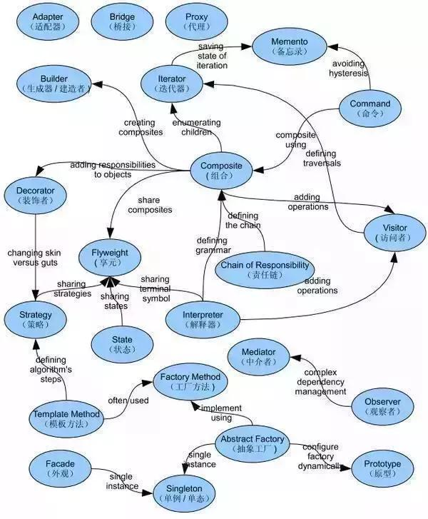
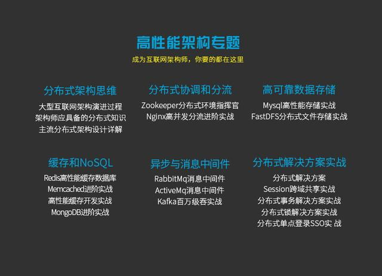
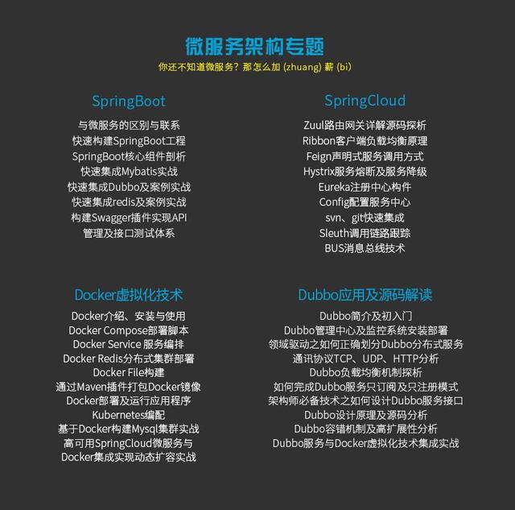
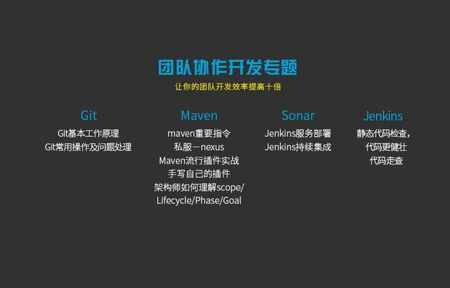
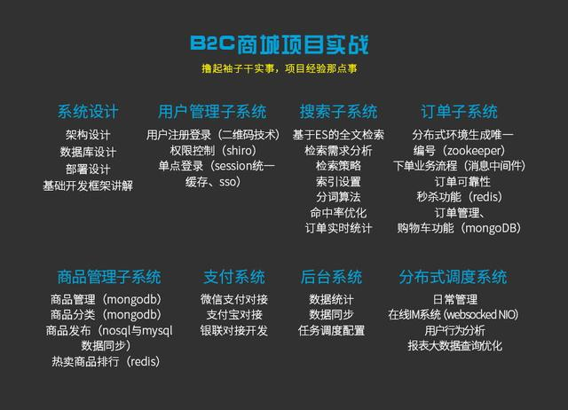

# Alibaba Senior Java


* 代码能力
```
代码能力是基本功，Java语言本身，包括语言的各个方面包括对并发的理解，对内存使用对理解，对Java运维的理解等等。语言本身外，社区里常用的框架是否可以十分清晰的了解，包括spring，包括他实现的ioc，aop，orm，web机制是否有清楚的认识，有丰富的经验等等。
对常用中间件的理解
毕竟在一个大系统中，各种中间件是是否常见的，缓存中间件，消息中间件，例如 redis、memcache、rmq这些。要理解常用中间件使用场景，使用姿势（例如redis的常用命令），甚至包括他的一些运维。一旦出了问题，除了专门的运维人员，也需要你参与问题的排查，因为有时候这些中间件出现问题，是不当的使用姿势引起的。
架构、业务落地能力
前面提到了语言本身，各种中间件。如果你有很好的业务抽象能力和架构思维，就可以把一款部门内部产品很好的设计并实施了。这点蛮难的。想必都有过接手现有项目的经历吧，有时候真恨不得把之前的设计者拿出来批斗。作为一个设计者，你能否做到当下一个接手它的人会说一句，这个系统设计的真好，稳定又可拓展，理解起来也很容易。
这需要很多能力，除了对现有系统的理解，还包括对未来可能发生变化的理解
沟通协作
毕竟一个部门内部产品，是不可能由一个人完成的，所以需要沟通协作，把设计好的方案，要和2-3个小伙伴一起实施，包括同样身份的后端人员，前端人员，产品等角色。这个级别的人可能会参与带2-3个人，例如应届毕业等，所以你自己对知识的把握，分享精神，leadership都是很好的加分项。
总的来说呢，到这个阶段，代码真的只是你技能桶中的一个最长的，或者最长的之一。而其他软技能，会显得越来越重要。

PS 年薪50w真的不算啥，具体几年可以达到，因人而异，不过大多数身边的人很多4-6年是这个水平。而他们只用了4-6年就达到了年薪50W，不是因为他们学历起点好，而是因为他们大多数对下面这些技术都掌握的八九不离十了
```
* 

```
详细介绍源码中所用到的经典设计思想，看看大牛是如何写代码的，提升技术审美、提高核心竞争力。

帮助大家寻找分析源码的切入点，在思想上来一次巨大的升华。知其然，并知其所以然。把知识变成自己的
```
* 

```
总体来说设计模式分为三大类：

创建型模式，共五种：工厂方法模式、抽象工厂模式、单例模式、建造者模式、原型模式。

结构型模式，共七种：适配器模式、装饰器模式、代理模式、外观模式、桥接模式、组合模式、享元模式。

行为型模式，共十一种：策略模式、模板方法模式、观察者模式、迭代子模式、责任链模式、命令模式、备忘录模式、状态模式、访问者模式、中介者模式、解释器模式。

其实还有两类：并发型模式和线程池模式。用一个图片来整体描述一下：
```

* 

```
迎接高并发大数据的挑战，从深度到广度完善知识体系，成为下一个互联网高薪人才。

理论结合实战，透彻理解分布式架构及其解决方案。

传统行业转型进入互联网行业的人群

分布式架构原理

1、分布式架构演进过程

2、如何把应用从单机扩展到分布式

3、CDN加速静态文件访问

4、系统监控、容灾、存储动态扩容

5、架构设计及业务驱动划分

6、CAP、Base理论以及其应用

分布式架构中间件

1、分布式架构网络通信原理剖析

2、通信协议中的序列化和反序列化

3、基于框架的RPC技术Webservice/RMI/Hessian

4、深入分析Zookeeper在disconf配置中心的应用

5、基于Zookeeper实现分布式服务器动态上下线感知

6、深入分析Zookeeper Zab协议及选举机制源码解读

7、Dubbo管理中心及监控平台安装部署

8、基于Dubbo的分布式系统架构实战

9、Dubbo容错机制及高扩展性分析

分布式架构实战

1、分布式全局ID生成方案

2、Session跨域共享及企业级单点登录解决方案实战

3、分布式事务解决方案实战

4、高并发下的服务降级、限流实战

5、基于分布式架构下分布式锁的解决方案实战

6、分布式架构下实现分布式定时调度
```

* 

```
微服务架构是一项在云中部署应用和服务的新技术

微服务不需要像普通服务那样成为一种独立的功能或者独立的资源

微服务作为一项在云中部署应用和服务的新技术已成为当下最新的热门话题

微服务的基本思想在于考虑围绕着业务领域组件来创建应用，这些应用可独立地进行开发、管理和加速。在分散的组件中使用微服务云架构和平台，使部署、管理和服务功能交付变得更加简单。

使用微服务构建现代化应用程序是很有意义的，因为它让你既利用了扩展横向扩展架构，也利用纵向扩展架构；还额外得到API的组合，且在整个业务中可重复利用。可能，每一分钟构都在交付新服务，这样你就必须拥有一个敏捷的且响应的应用程序平台，这一平台一直在不断改进中。
```

* 

```
Git

Maven

Jenkins

Sonar
```

* 

```
大型电商分布式系统应用实践，利用云服务器搭建真实的开发和部署环境，千人在线参与开发。

由浅入深的，带你从零到项目发布上线与运维，让你体验真实的企业级项目开发过程，掌握大牛的编码思维、经验与技巧
```