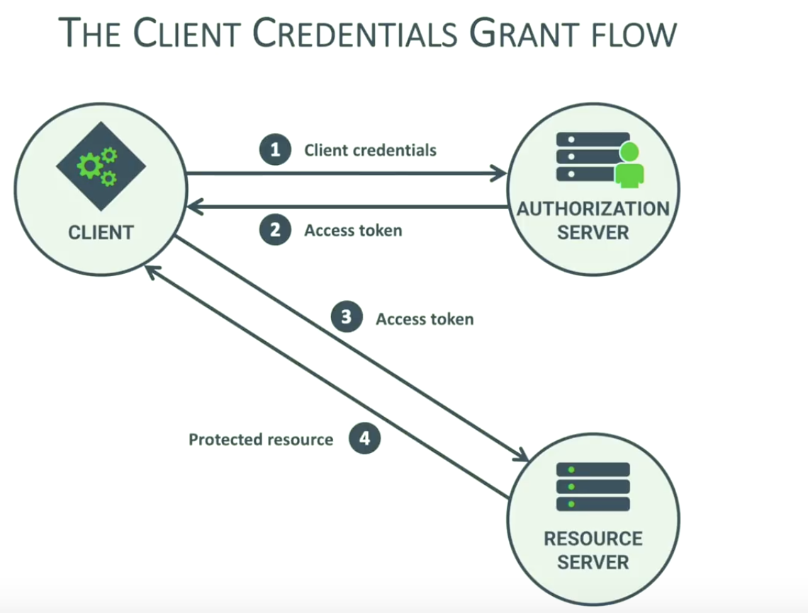
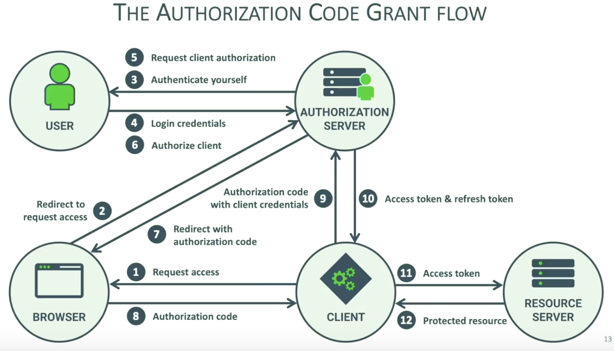
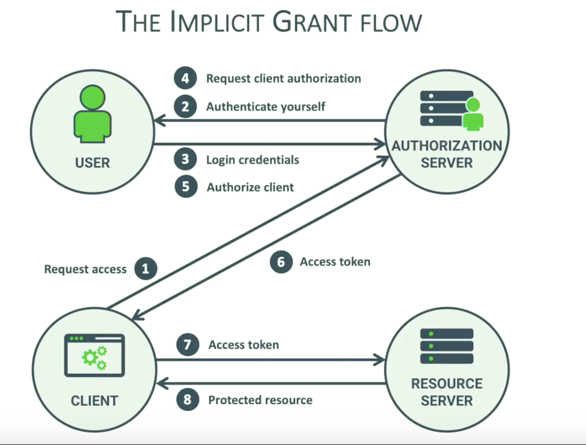

# OAuth Overview


## OAuth Grant Types

### Credential Client Grant

- 

direct access by the client application
access token obtained using client credentials

- 

  delegated access to a backend application
  access token obtained by exchanging code with client credentials
  refresh token can be used with client credentials

- 

  deletegrated access ot a frontend application
  access token directly obtained through the redirect
  not supposed to have access to refresh tokens

## Token Types

### Reference Token

- An identifier pointing to metadata keypt by the authorization server
- Authorization server retains full control over the metadata
- Require a backchannle request when received by the resource server
- Easy to revoke if needed

## Self-contained Token

```json
  {
      "sub": "philippe@secappdev.org",
      "aud": "https://pragmaticwebsecurity.com",
      "azp": "PragmaticWebSecurity",
      "iss": "https://twitter.example.com/",
      "exp": "1419356238",
      "iat": "1419350238",
      "scope": "read write",
      "jti": "405b4d4e-8501=4e1a-a138-ed8455cd1d47"

  }
  ```
  
- The token itself contains the metadata used by the authorization server
- Stored on the client, so out of reach from the authorization server
- Can be used independently by the resource server after integrity check
- Hard or impossible to revoke

## Reference

- [GOTO 2018 • Introduction to OAuth 2.0 and OpenID Connect • Philippe De Ryck](https://www.youtube.com/watch?v=GyCL8AJUhww)
- [OAuth 2.0: An Overview](https://www.youtube.com/watch?v=CPbvxxslDTU)
- [OAuth 2.0 and OpenID Connect](https://www.youtube.com/watch?v=996OiexHze0)
- [An introduciton to OpenID Connect](https://www.youtube.com/watch?v=6DxRTJN1Ffo)
- [OAuth Introduction and Terminology](https://www.youtube.com/watch?v=zEysfgIbqlg)
- [OAuth Grand Types](https://www.youtube.com/watch?v=1ZX7554l8hY)
- [OAuth2 and OpenID Connect](https://www.youtube.com/watch?v=i1datiYVDVc)
- [OAuth and OpenID Connect for Microservices](https://www.youtube.com/watch?v=BdKmZ7mPNns)