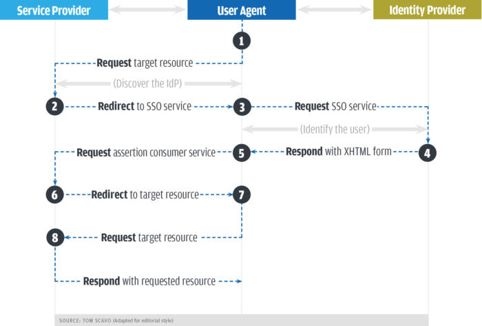

# SAML - Security Assertion Markup Language

# Capability Model

  - [Josh Fruhlinger](https://www.csoonline.com/author/Josh-Fruhlinger )

    ```
      The Security Assertion Markup Language(SANL) is an open standard that allows
    security credentials to be shared by muliple computers across a network. It
    describes a framework that allows one computer to perform some security functions
    on behalf of one or more other computer:
      - Authenticatio: Determining that the users are who they claim to be
      - Authorization: Determining if users have the rights to access certain systems
        or content
      Stickly speaking, SAML refers the XML variant language used to encode all
    this information, but the term can also cover various protocal messages and
    profiles that make up part of the standard.
    ```
# Theory
  
  - [Josh Fruhlinger](https://www.csoonline.com/author/Josh-Fruhlinger )

    ```
      A SAML assertion is the XML document by whick all the information we've 
    been discussing is transmitted from one computer to another. Once an identity
    provider has determined that you are who you say you are and have the right
    to access the content or services you're interested in, it sends a SAML 
    assertion to the server that actually can actually provide those services
    to you. A SAML assertion may be encrypted for increased security.
    ```
    
    ```
      1. You try to access the resource on the server, which in SAML terminology
      is sercie provider. The service provider in turn checks to see if you're 
      already authenticated within system. if you are, you skip to step 7; if
      you're not, the service provider starts the authentication process.

      2. The service provider determines the approprivate identity provider for'
      you and redirects you to that provider - in this case, the single sign-on
      service.
      3. Your browser sends an authentication request to the SSO service; the
      service then identifies you.
      4. The SSO service returns an XHTML document, which includes the authentication
      information needed by the service provider in a SAMLResponse parameter
      5. The SAMLResponse parameter is passed on the the service provider
      6. The service provider processes this response and creates a security context
      for you - basically, it logs you in - and then tells you where your requested
      resource is.
      7. With this information, you can now request the resource you're interested
      in again.
      8. The resource is finally returned to you  
    ```
 
# Contenders

  - [Saleforce Identity Provider](https://help.salesforce.com/articleView?id=identity_provider_about.htm&type=0 )

# reference

  - [What is SAML,What is it used for and how does it workhttps://www.csoonline.com/article/3232355/authentication/what-is-saml-what-is-it-used-for-and-how-does-it-work.html ) 
  - [OASIS - SAMLL](https://www.oasis-open.org/committees/tc_home.php?wg_abbrev=security )
  - [SAMLDiffs](https://wiki.shibboleth.net/confluence/display/SHIB/SAMLDiffs )
  - [SAML: The Secret to Centralized Identity Management](https://www.informationweek.com/software/information-management/saml-the-secret-to-centralized-identity-management/d/d-id/1028656 )
