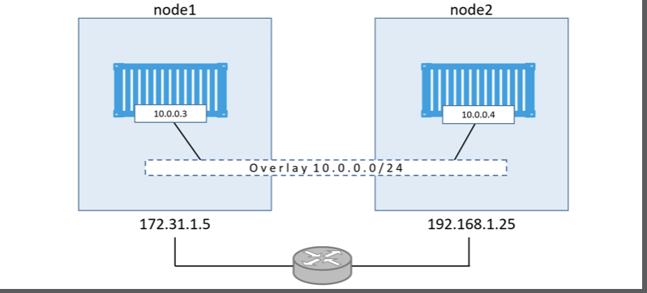
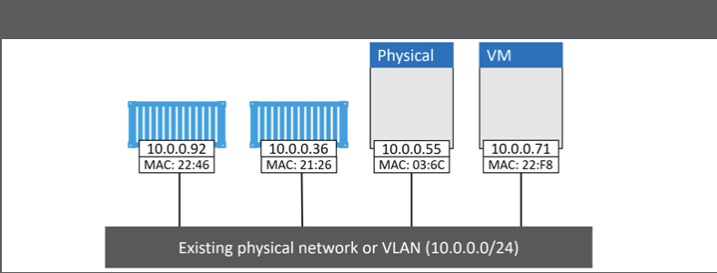
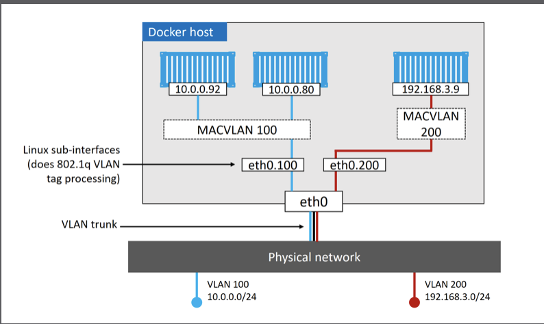

# Docker Overview

* [Docker Command](docker-command.md)

## Docker Concepts

* Why do we have containers?
* What do they do for us?
* Where can we use them?
* kernel namespaces
* control groups
* union filesystems
* Solomon Kykes
* Moby used to refer to the open-source Docker project on github “ https://github.com/moby/moby”
* dotCloud PaaS 2013 --> Docker Inc , Ben Golub
* Dockercon
* Docker Certified Associate
* somebody who loads and unloads cargo from ships
* Each Community Edition will be supported for 4 months
* Each Enterprise Edition will be supported for 12 months
* Docker version numbers follow the YY.MM-xx from Q1,2017, Dokcer 1.13 the last version.
* Batteries included but removable
* co-opetition( a balance of co-operation and competition)
* frenemy(a mix of a friend and an enemy)
* Open Container Initiative - ecosystem
* OCI is a governace council responsible for standardizing the most fundamental componets of container infrastructure such as image format(image-spec) and container runtime(runtime-spec),the first version was released in July 2017
* Rocket
* [HyperKit](https://blog.docker.com/2016/05/docker-unikernels-open-source/)
* Docker EE includes Docker Trusted Registry and Universal Control Plane
* storage driver
* devicemapper
* follows the tried-and-tested Unix philosophy
* "daemonless containers" it makes it possible to perform maintenance and upgrades on the Docker daemon without impacting running containers
* images are considered build-time constructs
* containers are considered run-time constructs
* hypervisor : a type of OS that is highly tuned for VMs
* PID 1 is the bash shell 
* type exit inside container means it exit the Bash shell, the container will also exit(terminate). the reason for this is that a container cannot exist without a running process 
* killing the bash shell kills the container's only process, killing the main process in the container will alos kill the container
* Press ctrl-PQ to exit the container without terminating it, Doing this will place ou back in the shell of your Docker host and leave the container running in the background.

## Upgrading Docker

* upgrading process
 
1. Stop the Docker daemon
2. Remove the old version
3. Install the new version
4. configure the new version to automatically start when the system boots
5. Ensure containers have restarted

* ubuntu upgrading docker

1. apt-get update
2. apt-get remove docker docker-engine docker-ce docker.io -y
3. wget -qO- https://get.docker.com/ | sh
4. systemctl enable docker
5. systectl is-enabled docker
6. docker container ls

## Storage drivers

* aufs(the original and oldest)
* overlay2(probably the best choice for the future)
* devicemapper
* btrfs
* zfs
* windowsfilter(windows only which implements layering and Copy-on-Write on top of NTFS)

A storage driver is a per node decision. This means a single Docker host can only run a single storage driver

```json

  /etc/.docker/daemon.json
  {
      "storage-driver": "overlay2"
  }
```

If someone change the storage driver on an already-running Docker host, existing images and containers will not be available after Docker is restarted. This is because each storage driver has its own subdirectory on the host whsere it stores image laysers(usually /var/lib/docker/<storage-driver>)

## Devicemapper

* Block devices.
  You need to have block devices available in order to configure direct-lvm mode. Thess should be high performance external LUNs. If your Docker environment is on-promises, external LUNs can be on FC,iSCSI, or other block-protocol storage cloud, these can be any form of high performance block storage(usually SSD-based) supported by your cloud provider.

* LVM config.
  The devicemapper storage driver leverages LVM, the Linux Logical Volume Manager. This means you will need
  to configure the required physical devices(pdev), volume group(vg), logical volumes(lv), and thinpool(tp). You should use dedicated physical volumes and form them into a new volume group. You should not share the volume group with non-Docker workloads; one for data and the otehr for metadata. Create an LVM profile spefifying the auto-extend threshold and auto-extend values,and configure monitoring so that auto-extend operations can happen.

* Docker config
  The current Docker config file(/etc/docker/daemon.json) and then update it as follows. The name of the dm.thinpooldev might be different in your environment and you should adjust as appropriate.

```json
  {
    "storage-driver": "devicemapper",
    "storage-opts":[
      "dm.thinpooldev=/dev/mapper/docker-thinpool",
      "dm.use_deferred_removal=true",
      "dm.use_deferred_deletion=true"
    ]
}
```

## Local Docker socket

```bash
#!/bin/bash

  ls -la /var/run/docker.sock
```

## priviledges

  if to use 'sudo docker version' command to get right response, you will need to add use account to the local docker group.

## Docker Engine

* 
* 
* 

client:
The docker client made the appropriate API calls to the Docker daemon

daemon:
Docker client converts the commands into the approprivate API payload and POSTs them to the correct API endpoint. the API implemented in the daemaon. The daemon communicates with containerd via a CRUD-style API over gRPC. till now, daemon includes : image management, image builds, the REST API, authentication, security, core networking and orchestration.
The Docker daemon accepted the command and searched the Docker host's local cache to see if it already had a copy of the requested image.
Once the image was pulled, the daemon created the container and executed the spefified app inside of it.

containerd:
A new tool called containerd(pronounced container-dee) is to manage container lifecycle operation - start | stop | pause | rm ... since 1.11 release. containerd sits between the daemaon and runc at the OCI layer. Kubernetes can also use
containered via cri-containerd. It was developed by Docker, Inc and donated to Cloud Native Computing Foundation(CNCF). It released version 1.0
in December 2017.

shim:
The shim is integral to the implementation of daemonless containers(about decoupling running containers from the daemon for things like daemon upgrades). the containerd uses runc to create new containers. In fact, it forks a new instance of runc for every container it creates. However, once each container is created, its parent runc process exits. This means we can run hundreds of containers without having to run hundreds of runc instances. Once container's parent runc process exits, the associated containerd-shim process becomes teh container's parent. Some of the responsibilities the shim performs as a container's parent include:

* keeping any STDIN and STDOUT streams opens so that when the daemon is restarted, the container doesn't terminate due to pipes being closed etc.
* Reports the container's exit status back to the daemon.

runc:
The tool called runc is the reference implementation of the OCI container-runtime-spec.
from Docker 1.11(early 2016),in fact, It is a small,lightweight CLI wrapper for libcontainer(originally replaaced LXC in the early Docker architecture)

dockerd(the Docker daemon)
docker-containerd(containerd)
docker-containerd-shim(shim)
docker-runc(runc)

## Image Registries

Docker image are stored in image registries. The most common registry is Docer Hub(httlps://hub.docker.com) Other registires exists, including 3rd party registries and secure on-promises registires.

Most of the popular operating system and applications have their own official repositories on Docker Hub. They're easy to spot because they live at the top level of the Docker Hun namespace. the following list contains a few of the official repositories, and shows their URLs that exist at the top-level of the Docker Hub namespace:

* nginx: https://hub.docker.com/_/nginx/
* busybox: https://hub.docker.com/_busybox/
* redis: https://hub.docker.com/_/redis/
* mongo: https://hub.docker.com/_/mongo/

## Images and Layers

 
 docker image inspect alpine:latest

## Image Digests

Docker 1.10 introduced a new content addressable storage model. As port of this new model, all images neow get a cryptographic content hash. /for the purposes of this discussion, we'll refer to this hash as the digest. Becasue the digest is a hash of the content of the image, it is not possible to change the contents of the iamge without the digest also changing. This means digests are immutable. Each layer also gets something called a distribution hash. This is a hash of the compressed version of the layer.

## VM vs Container

* 
* 

The VM model carves low-level hardware resources into VMs. Each VM is a software construct containing virtual CPU, virtual RAM, virtual disc etc. As such, every VM needs its own OS to claim, initialize, and manage all of those virtual resources. And sadly, every OS comes with its own set of baggage and overheads. For example, ervery OS consumes a slice of CPU, a silce of RAM, a slice of storage etc. Most need their won license as well as people and infrastructure to patch and upgrade them. Each OS also presents a sizable attack surface. We often refer to all of this
as the OS tax, or VM tax - every OS your install consumes resources!

The container engine takes OS resources such as the process tree, the filesystem,and the network stack. The Container model has a single kernel running in the host OS. It's possible to run tens or hundreds of containers on a single host with every container sharing that single OS/kernet. That means a single OS consuming CPU,RAM and storage. A single OS that needs licensing. A single OS that needs upgrading and patching. And a single OS kernel presenting an attack surface. All in all , a single OS tax bill. There's no kernel inside of a container that needs locating,decompressing,and intiallizing associated with a normal kernel bootstrap. None of that is needed when starting a container! The single shared kernel, down at the OS level, is already started! Net result, containers can start in less than a second. The only thing that has an impact on container start time is the time it takes to start the applicaton it's running.

At a high level, we can say the hypervisors perform hardware virtualization - they carve up physical hardware resources into virtual versions. On the other hand, containers perform OS virtualization - they carve up OS resources into virtual version.

The VM tax

The VM model carves low-level hardware resources into VMs. Each VM is a software construct containing virtual CPU, virtual RAM, virtual disk etc. As such, every VM needs its own OS to claim, initialize, and manage all of those virtual resources. And sadly, every OS comew tih its own set of baggage and overheads. For example, every OS consumes a slice of CPU, a slice of RAM, a slice of storage etc. Most need their own licenses as well as people and infrastructure to patch and upgrade them. Each OS also presents a sizeable attack surface. We often refer to all of this as the OS tax, or VM tax - every OS you install consumes resources!

The container model has a single kernel running in the host OS. It's possible to run tens or hundreds of containers on a single host with every container sharing that single OS/kernel. That means a single OS consuming CPU, RAM, and storage. A single OS that needs licensing. A single OS that needs patching and upgrading. And kernel presenting an attack surface. All in all, a single OS tax bill!

Starting time

Because a container isn't a full-blown OS, it stars much faster than a VM. Remember,there's no kernel inside of a container that needs locating, decompressing, and initializing - not to mention all of the hardware enumerating and initializing associated with a normal kernel bootstrap. None of that is needed wehn starting a container! The sinlge shared kernel, down at the OS level, is already started! Net result, containers can start in less than a second. The only thing that has an impact on container start time is the time it takes to start the application it's running.

## Docker Remote API

 In a standard, out-of-the-box Linux installation, the Docker daemon implements the Docker Remote API on a local IPC/Unix socker at /var/run/docker.sock. On Windows, it listen on a named pipe at npipe:////./pipe/docker_engine. It's also possible to configrute the Docker client and daemon to communicate over the network. The default non-TLS network port for Docker is 2375, the default TLS port is 2376.

## Docker lifecycle

* stop a container vs rm a container 

"docker continaer stop [containername|containerId]"
"docker container ls -a" showing as Existed(0) with status. 
Stopping a container is like stopping a virtual machine. Although it's not currently running. Its entire configruation and contents still exist on the filesystem of the Docker host, and it can be restarted at any time.
Stopping a container does not destory the container or the data inside of it.
A best practice to take the two-step approach of stopping the container first and then deletingit.

## Self-healing

It's a form of self-healing that enables Docker to automatically restart them after certain events or failures have occurred.
Restart policies are applied per-container, and can be configured imperatively on the command line as part of docker-container run commands.
the following restart policies exist:

* no (Do not automatically restart the container, default)
* always
* unless-stopped
* on-failed
* [Start Containers Automatically](https://docs.docker.com/config/containers/start-containers-automatically/)

The always policy is the simplest. It will always restart a stopped container unless it has been explicitly stopped, such as via a docker container stop command.You start a new container with --restart always policy and then stop it with the docker container stop command. At this point the container is in the Stopped(Exited) state. However, if you restart the Docker daemon, the container will be automatically restarted when the daemon comes back up.

The unless-stopped policy will not be restarted when the daemon restarts if they were in the Stopped(Exited) state.We'll create two new containers. One called "always" with the --restart always policy, and one called "unless-stopped" with the --restart unless-stopped policy. We'll stop them both with the docker container stop command and then restart Docker. The "always" container will restart, but the "unless-stopped" container will not.

The on-failure policy will restart a container if it exits with a non-zero exit code. It will also restart containers when the Docker daemon restarts, even containers that were in the stopped state.

## Containerizing an app

* 

### The basic flow with high level

* Get the app code
* Inspect the Dockerfile
* Containerize the app
* Pushing images
* Run the app
* Test the app
* Look a bit closer
* Move to production with Multi-stage Builds
* A few best practices

### The Detail

#### Get the app code

git clone https://github.com/nigelpoulton/psweb.git

#### Inspecting the Dockerfile

This is the file describes the application and tells Docker how to build it into an image.
the Dockerfile has two main purpose:

* To describe the application
* to tell Docker how to containerize the application(create an image with the app inside)

Do not underestimate the impact of the Dockerfile as a from of documentation! It has the ablility to help bridge the gap between development and operations! It also has the power to speed up on-boarding of new developers etc. This is because the file accrurately describe the application and its dependences in an easy-to-read format. As such, it should be treated as code, and checked into a source control system.

```Dockerfile
FROM alpine
LABEL maintainer="nigelpoulton@hotmail.com"
RUN apk add --update nodejs nodejs-npm
COPY . /src
WORKDIR /src
RUN npm install
EXPOSE 8080
ENTRYPOINt ["node","./app.js"]
```

At a high level, the example Dockerfile says:Star with alpine image, add "nigelpoulton@hotmail.com" as the maintainer, install Node.js and NMP, copy in the application code, set the working directory, install dependencies, document the app's network port, and set app.js as the default application to run.

Every From instruction constitutes a distinct build stage

#### Containerize the app/build the image

```bash
#!/bin/bash
docker image bulid -t web:latest .
```

#### Test the app

* Make sure that the container is up and running with "docker container ls".
* Using http client or test toolkit to check web server health url

#### Pushing images

```bash
#!/bin/bash
docker login

# Registry Repository Tag
# If It doesn't specified Registry, Docker will assume Regiestory=docker.io and 
# Tag=latest. all of private images have to sit wihtin the second-level namespace.
# This means we need to re-tag the image to include my Docker ID
docker image tag alpine-rsync:latest zzq635/alpine-rsync:latest
docker image push zzq635/alpine-rsync:latest
```

#### Run the app

```bash
#!/bin/bash
docker container run -d --name c1 -p 80:8080 alpine-rsync:latest
```

#### Look a bit closer

* Comment lines in a Dockerfile start with the # character
* Instruction names are not case sensitive
* but it sis normal practice to write them in UPPERCASE
* create new layers are FROM,RUN,and COPY
* create metadata include EXPOSE, WORKDIR, ENV and ENTRYPOINT

#### Multi-stage builds

## Docker Networking

### Container Netwrok Model - CNM

* Docker networking is based on an open-source pluggable architecture called the Container Netwrok Model
* libnetwork is Docker's real-world implementation of CNM, and it provides all of Docker's core networking capabilities.
* Docker ships with a set of native drivers that deal with the most common networking requirements. These include single-host bridge networks, multi-host overlays, and options for plugging into existing VLANs. Ecosystem partners extend things even further by providing their own drivers.

### Dockering Networking High Level

* [The Container Network Model - CNM](https://success.docker.com/article/networking)

It's design specification. It outlines the fundamental building block of a Docker network.


* [libnetwork](https://github.com/docker/libnetwork/blob/master/docs/design.md)

It's written in Go, and implements the coere components outlined in the CNM
It implements native service discovery, ingress-based container load balancing, and the network control plane and management plane functionality.

* 

It extend the model by implementing specific network topologies such as VXLAN-based overylay networks.
It implements the data plane, for example, connectivity and isolation is all handled by drivers. So is the actual creation of network object.
Docker ships with serveral built-in drivers, known as native drivers or local drivers. On Linux they include; bridge, overlay,and macvlan. On Windows they include; nat, overlay,transparent, and 12bridge.
3rd-parties can also write Docker network drivers. These are known as remote drivers, and example include calico, contiv,kuryr, and weave.

### Docker Networking Driver

#### Single-host bridge networks

* 

* the default bridge network on Linux does not support name resolution via the Docker DNS service. All other user-defined bridge networks do!
* Single-host bridge networks are the most basic type of docekr network and are suitbale for local development and very small applications. They do not scale, and they requrie port mapping if you want to publish your services outside of the network.
* Docker on Linux implements bridge networks using the built-in bridge driver, whereas Docker on Windows implements them using the built-in nat driver.

#### Multi-host overlay networks

* 
* They allow a single network to span multiple hosts so that containers on different hosts can communicate at layer 2. They're ideal for container-to container communication, including container-only application, and they scale well.
* Docker provides a native driver for overlay networks. This makes creating them as simple as adding the -d overlay flag ot the docker network create command.
* It allows you to create a flat,secure,layer-2 network, spanning multiple hosts. Cotainers connect to this and can communicate directly.
* Linux should have at least a 4.4 Linux kernel and Windows should be Windows Serer 2016 with the latest hotfixes installed.
* allow ports 2377/tcp, 7949/tcp and 7946/udp with Swarm orchestration.
* Docker overlay networking uses VXLAN tunnels to create virtual Layer 2 overlay networks.
* Each end of the VXLAN tunnel is terminated by a VXLAN Tunnel Endpoint(VTEP) which performs the encapsulation/de-encapsulation
* 
* a sandbox(network namespace) which is running an application is created on each host
* a virtual switch called Br0 is created inside the sandbox
* a VTEP as aslo created with one end plumbed into the Br0 vitual switch
* they get IP address on the underlay network the host is connected to.
* they use a UDP socket on port 4789
* VTEP on each host create the overlay via a VXLAN tunnel
* each container get its own virtual Ethernet(vech) adaptor that is also plumed into the local Br0 vitual switch.
* C1 creates the ping request and sets the destination IP address to be the 10.0.0.4 address of C2. It sends the traffic over its veth interface which is connected to the Br0 virtual switch. The virtual switch doesn't know where to send the packat as it doesn't have an entry in its MAC address table(ARP table) that corresponds to the destination IP address. As a result, it floods the packat to all ports. The VTEP interface connected to Br0 knows how to forward the frame, so responds with its own MAC address. This is proxy ARP reply and results in the Br0 switch learning how to forward the package. So it update its ARP table. mapping 10.0.0.5 to MAC address of the local VTEP. Now that the Br0 switch has learned how to forword traffic to C2, all future packets for C2 will be trasmitted directly to the VTEP interface. The VTEP interface knows about c2 because all newly started containers have their network details propagated to other nodes in the SWarm using the network's built-in gossip protocol.The switch then sends the sends the packet to the VETP interface, which encapsulates the frames so they can be send over underlay transport infrastructure. At a fairly high level, this encapsulation include adding a VXLAN header to the Ethernet frame. The VXLAN header contains the VXLAN network ID(VNID) which is used to map frames from VXLANs to VXLANs and vice versa. Each VLAN gets mapped to VNID so that the packet can be de-encapsulated on the receiving end and forwarded to the correct VLAN. This obviously maintain network isolution. The encapsulation also wraps the frame in a UDP packet with the IP field, and the UDP port 4789 socket information. This encapsulation allows the data to be sent across the underlying networks without the underlying networks having to know anything about VXLAN. When the packet arrives at node 2, the kernel see that it's addressed to UDP port 4789. The kernel also knows that it has a VTEP interface bound to this socket. As a result, it sends the packet to the VTEP, which reads the VNID, de-encapsulateds the packet,and sents it on to its own local Br0 switch on the VLAN that corresponds the VNID. Frome there it is delivered to container c2
* Docker also support Layer 3 routing within the same overlay network. For example, you can create an overlay network with two subnets, and Docker will take care of routing between them. The command to create a network like this could be docker network create --subnet=10.1.1.0/24 --subnet 11.1.1.0/24 -d overlay prod-net. this would result in two virtual switches, Br0 and Br1, being created inside the sandbox,and routing happens by default.


#### Connecting to existing networks

The ability to connect containerized apps to external systems and physical networks is vital. A common example is a partially containerized app - the containerized parts will need a way to commmuinicate with the non-containerized parts still running on existing physical networks and VLANs.

* 

The built-in MACVLAN dirver(transparent on Windows) was created with this in mind. It makes containers first-class citizens on the existing physical networks by giving each one its own MAC and OP address. On the positive side, MACVLAN performance is good as it doesn't require port mappings or additional bridges - you connect the container interface through to the hosts interface (or a sub-interface). On the negative side, it requires the Host NIC to be in promiscuous mode. which isn't allowed on most public cloud platforms. So MACVLAN is great for your corporate data center networks(assuming your network team can accommodate promiscuous mode), but it won't work in the public cloud.

* 


## Note

* It is best practice to use non-root users when working with Docker,you need to make sure it's a member of the local docker Unix group. If it isn't, you can add it with usermod -aG docker <user> then log out and log back to take effect.

```bash
#!/bin/bash
  sudo usermod -aG docker <user>
  cat /etc/group | grep docker
  docker:x:999:<user>
```

* libcontainer

till Docker 0.9, Dokcer depends on LXC which is Linux-specific. after that, Docker. Inc. developed theire own tool called libcontainer as a replacement for LXC. The goal of libcontainer was to be a platform-agnostic tool

* dangling image

  docker image ls --fliter dangling=true

A dangling image is an image that is no longer tagged, and appears in listings as <none>:<none>.
A common way they occur is when building a new image and tagging it with an existing tag. When this happens. Docker will build the new image. notice that an existing image has a matching tag, remove the tag from the existing image, give the tag to the new image. For example, you build a new image based on alpinle:3.4 and tag ti as dodge:challenger. The you update the Docker to replace a alpine:3.4 with alpine:3.5 and run the exact same docker image build command. The build will cerate a new image tagged as dodge:challenger and remove the tags from the older image. The older image will become a dangling image.

Docker currently support the following filters:

1. dangling: Accepts true or false, and returns only dangling iamge(true), or non-dangling image(false)
2. before: Requries an image name or ID as argument, and returns all images created before it
3. since : Same as before, but returns images created after the specified image
4. lable: Filters images based on the presence of a label or label and value. The docke iamge ls command does not display labels in its output.

docker image ls --filter=reference="*:latest"

## Reference

* [building docker environment](https://john-hunt.com/2016/06/03/docker-os-x-homebrew-quick-start/)
* [Docker Deep Dive - Nigel Poulton]
* [Play with Docker](https://play-with-docker.com)
* [Open Container](https://github.com/opencontainers)
* [Containerd](https://github.com/containerd)
* [Image Registry](https://hub.docker.com)