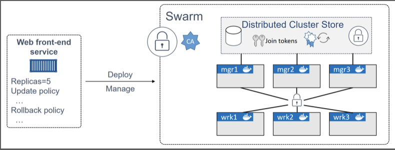
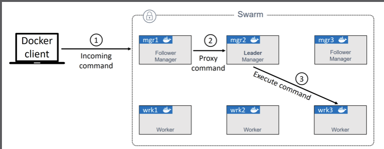

# Swarm Overview

* An enterprise-grade secure cluster of Docker hosts.
* An engine for orchestrating microservices apps
* 

## Cluster of Docker

It groups one ore more Docker nodes and lets you manage them as a cluster. Out-of-the-box you get an en encrypted distributed cluster store,encrypted networks,mutual TLS, secure cluster join tokens, and a PKI that makes managing and rotating ceriticateds a breeze!

These can be physical servers ,VMs, Raspberry Pi's, or cloud instances. The only requirements is that all nodes cam communicate over reliable networks.

* The configuration and state of the swarm is held in a distributed etcd database located on all manager. It's kept in memory and is extremely up-to-date.
* To use TLS to encrypt communication,authenticate nodes, and authorized roles.
* CA settings
* join tokens
* Automatic key rotation
* 2377/tcp: for secure client-to-swarm communication
* 7946/tcp and 7946/udp: for control plane gossip
* 4789/udp: for VXLAN-based overlay networks

## Orchestration

It exposes a rich API that allows you to deploy and manage complicated microservices apps with ease. You can define your apps in declarative manitest files, and deploy them with native Docker commands. You can even perform rolling updates, rollbacks and scaling operation.

* the atomic unit of scheduling on a swarm is the service
* a container is wrapped in a service we call it a task or a replica, and service construct adds things like scaling, rolling updates, and simple rollbacks.

## Building a Swarm

### The process of building a swarm(initialzing a swarm)

* Initialize the first manager node
* Join addtional manager nodes
* Join worker nodes

## Swarm manager high availability (HA) 

* Swarm managers have native support for high availability(HA). This means one or more cal fail, and the sruvivors will keep the swarm running. 
* There are multiple managers, only one of them is ever considered active. It calls this active manager the 'leader', and the leader's the only one that will ever issue live commands against the swarm.
* 
* swarm uses an implementation of the [Raft consensus algorithms](https://raft.github.io) to power manager HA

## Actual State vs Desired State

## Replicated vs Global services

The default replication mode of a service is replicated. This will deploy a desired number of replicas and distributed them as evenly as possible across the cluster.
The other mode is global, which runs a single replica on every node in the swarm.
To deploy a global service you need to pass the --mode global flag to the docke service create command

## Scaling a service

Feature of services is the ability to easily scale them up and down.
Bebind the scenses,swarm runs a scheduling algorithm that defaults to balancing replicas as evenly as possible across the nodes in the swarm.
But this balance whether takes into account about CPU load depends their implementations

## Rolling updates

* docker service update --update-parallelism --update-delay 

```bash
#! /bin/bash
docker service update --image <dockerID>/<image-name>:<update-tag> --update-parallelism 2 \ # the new image was pushed to 2 replicas at a time 
--update-delay 20s # with a 20 seconds cool-off period in between each
<service-name>
```

* Some of the requests will be services by replicas running the old version and some will be serviced by replicas running the new version s. After enough time, all requests will be serviced by replicas running the updated version of the service.

* docker service inspect --pretty <service-name>

## Container and Service logs

* docker service logs command
* container logs work on the premise that your application is running as PID 1 in its container and sending logs to STDOUT and errors to STDERR.
* If application logs on a file, it's possible to use a symlink to redirect log-file writes to STDOUT and STDERR

### Log Level

* debug
* info
* warn
* error
* fatal

### Log Configruation

```daemon.json
{
  "debug": true,
  "log-level": "debug"
  "log-driver": "syslog"
}
```

You can configure an individual container, or service, to start with a particular logging driver with --log-driver and -log-opts flags. These will override anything set in daemon.json

### Log Driver

* json-file(default)
* journald(only works on Linux hosts running systemd)
* syslog
* splunk
* gelf

## Service Discovery

### libnetwork provides the Service Discovery

It allows containers and Swarm services to locate each other by name. The only requirement is that they be on the same network.

### Docker embedded DNS server

* 
* Every Swarm Service and standalone container started with --name flag will regist its name and IP with the Docker DNS service. This means all containers and service replicas can use the Docker DNS service to find each other
* service discvoery is network-scoped. This means that name resolution only works for containers and service on the same netowrk. If two containers are on different networks, they will not be able to resolve each other.
* It possible to configure Swarm serice and standalone containers with customized DNS with --dns option

* step 1 : the ping c2 command invokes the local DNS resolver to resovle the name c2 to an IP address. All Docker containers have a lcoal DNS resovler.
* Step 2 : If the local resolver does not have an IP address for c2 in its local cache, it initiates a recursive query to the Docker DNS server. The local resovler is preconfigured to know the details of the embedded Docker DNS server
* Step 3 : The Docker DNS server holds name-to-IP mappings for all containers created with the --name or --net-alias flags. This means it knows the IP addres of container c2
* Step 4 : The DNS server returns the IP address of c2 to the local resolver in c1. It does this because the two containers are on the same network - if they were on different network this would not work
* Step 5 : the ping command is sent to the IP address of c2

## Load balancing

### Swarm publishing modes

* Ingress mode(default)
* Host mode
* [Swarm Publish Mode](img/swarm-publish-mode.png)

#### ingress mode

Services published via ingress mode can be accessed from any node in the Swarm -even nodes not ruuning a service replica. 

* 
* 

Ingress mode uses a layer 4 routing mesh called the Service Mesh or the Swarm Mode Sercie Mesh.

```bash
#! /bin/bash
docker servcie create -d --name svc1 --network overnet \
--publish published=5000,target=80 nginx
```

* The command at the top is deploying a new Swarm servcie called svc1, it's attaching the servcie to the overnet network and publishing it on port 5000.
* publishing a swarm servcie like this (--publish published=5000,target=80) will publish it on port 5000 on the ingress network. As all nodes in a Swarn are attached to the ingress work, this means the port is published swarm-wide.
* Logic is implemented on the cluster ensuring that any traffic hitting the ingress network, via any node, on port 5000 will be routed the svc1 service on port 80
* At this point, a single replica for the svc1 sercie is deployed, and the cluster has a mapping rule that says "all traffic hitting the ingress network on port 5000 needs routing on a node running a replica for the svc1 servcie"
* The red line show traffice hitting node1 on port 5000 and being routed to the servicie replica running on node2 via the ingress network
* It's vital to know that the incoming traffic could have hit any of the four swarm nodes on port 5000 and we would get the same result. This is because the service is published swarm-wide var the ingress network
* It's also vital to know that if there were multiple replicas running, the traffic would be balanced across all replicas.
* If you run the docker network ls command and can't see the overlay network. It is because new overlay networks are only made available to worker nodes that are running containers attached to them. This lazy approach improves network scalability by reducing the amount of network gossip.
* You'll create service with two replicas , it will automatically extend them via overlay network among nodes.


#### Host mode

* Services published via host mode can only be accessed via nodes running servcie replicas.
* Single-host bridge networks are the most basic type of docekr network and are suitbale for local development and very small applications. They do not scale, and they requrie port mapping if you want to publish your services outside of the network.
* Docker on Linux implements bridge networks using the built-in bridge driver, whereas Docker on Windows implements them using the built-in nat driver.

* [Docker Deep Dive - Nigel Poulton]
